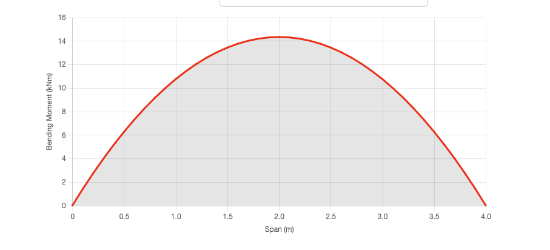
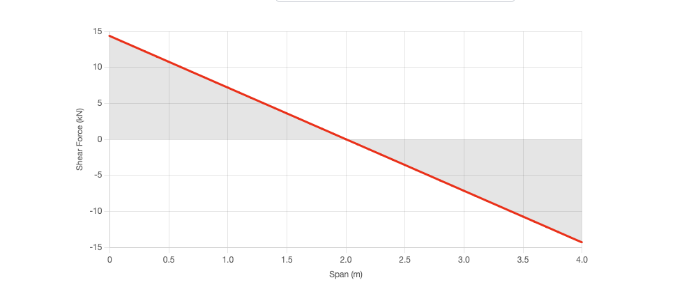
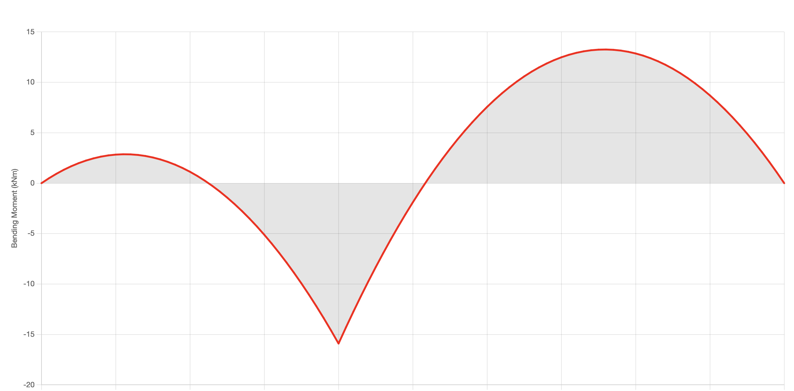
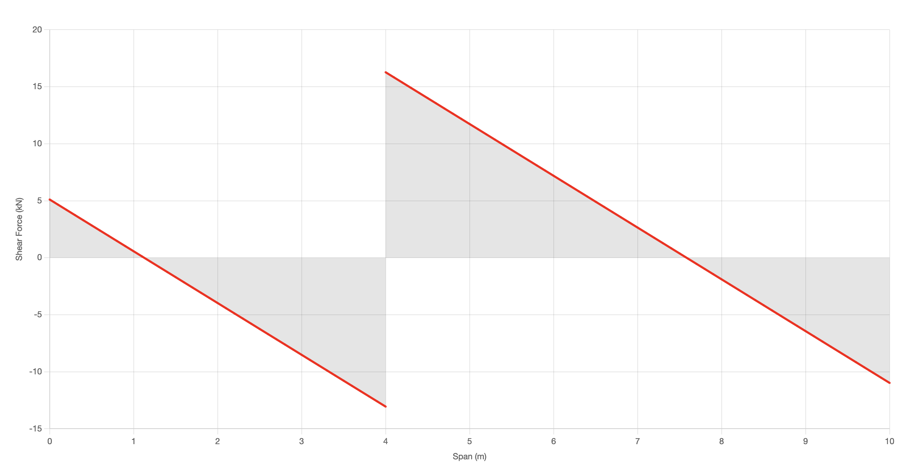

### Instructions

* Clone or fork this repository.
* Create a new branch, `{user}-assignment`, for your work.
* Invite @ikhsan017 to be a collaborator.

### Tasks

 * Cromplete the `BeamAnalysis.analyzer` sub-class in `js/beam-analysis.js` to calculate the forces
 * Intended usage is shown in `index.html`
 * Calculation model is provided in `excel/beam-analysis.xlsx` directory.
 * You are free to use any library or framework to help you with the chart.

### Expected Result

#### Simply Supported Analysis

#### Two Span Unequal Analysis

